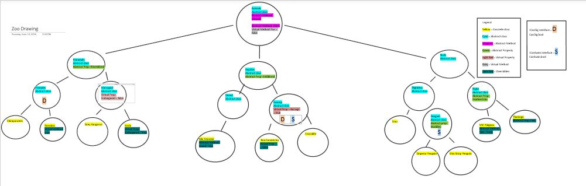
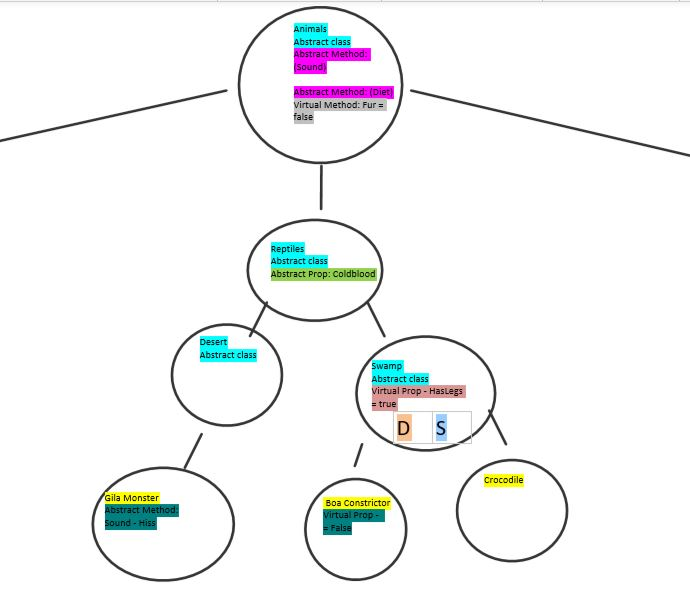

1. Name 
#Lab 05 I Built a Zoo!

2. Questions to Answer

#Lab Part 1 of 2
1. An introduction to the project:
A one-Liner - This is a C# Console application acting as an organizer for a zoo, consisting of classes and interfaces.

2. Your digital drawing of your zoo
Please refer to the visual below.

3. Create your own technical documentation. 
Breakdown and define each of the OOP principles in your own words. 
Provide under each OOP definition a couple (you do not have to define all) of examples of how you are applying this into your project
	
	a. Inheritance - 
	
	Ex: 
	
	b. Abstraction - 
	
	Ex: 
	
	c. Polymorphism - 

	Ex: 
	
	d. Encapsulation - 

	Ex: 

#Lab Part 2 of 2
1. Define what an interface is in your own words.

2. Describe what your interfaces are, where are they being implemented, and why.

2a. Provide Examples.

3. Updated diagram with your interfaces mapped out.
Please refer to the visual below.

Visual

Figure 1 - Entire Diagram

Figure 2 - Left side of Diagram

Figure 3 - Middle View of Diagram

Figure 4 - Right side of Diagram with Legend

4. API
No API's were harmed in the making of this.

5. Installation
Install Visual Studio 2017 and .NET Core SDK.

6. License
This program's License is MIT.
