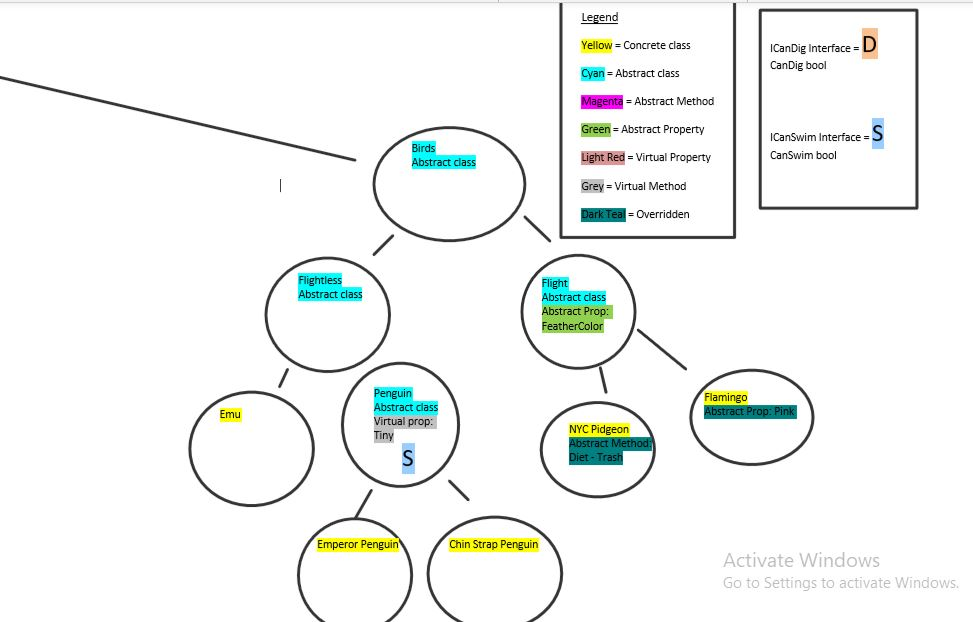

# Lab 05 I Built a Zoo!

Questions to Answer

## Lab Part 1 of 2
1. An introduction to the project:
A one-Liner - This is a C# Console application acting as an organizer for a zoo, consisting of classes and interfaces.

2. Your digital drawing of your zoo
Please refer to the visual below.

3. Create your own technical documentation. 
Breakdown and define each of the OOP principles in your own words. 
Provide under each OOP definition a couple (you do not have to define all) of examples of how you are applying this into your project
	
	a. Inheritance - Getting something from something quickly. It's like having traits connected to parents. Say if brown eyes run in your family, you get them.
	
	Ex: To show inheritance, in the Reptiles class, the abstract property is Coldblooded. All reptiles moving forward will have the Coldblooded property.
	
	b. Abstraction - It is a class that has no form. It is not concrete. It's literally abstract and has no explicit purpose. 
	
	Ex: My Animal class is abstract because it connects to many other classes such as the Reptiles, Mammals and Birds. These are also abstract because they connect to more classes. But the Animal class is not specific and holds choices that will eventually lead to the concrete classes.
	
	c. Polymorphism - This changes the behavior of classes, properties or methods. I think of it as like jobs. Some jobs have to be done in a specific procedure or lots can go wrong such as lawyers or doctors. While other jobs are open to creativity and don't have a set solution such as artists or performers.
	
	d. Encapsulation - This is the ability to cover or bundle up. Much like a blanket but with varying degrees of visibility. If it were public, the blanket is see through and wide, open to everyone. If private, the blanket is more clouded. If protected, the blanket is still clouded but with frills on the end for the children. 

## Lab Part 2 of 2
1. Define what an interface is in your own words.
An interface tells you what to do. I think of it as a sticky note with important instructions on what the class should do.

2. Describe what your interfaces are, where are they being implemented, and why.
My interfaces are ICanDig and ICanSwim. The ICanDig and ICanSwim will have a bool, asking the class if they dig or swim, respectively.

2a. Provide Examples.
The Primates class has the ICanDig interface on it and will be assigned true.
The Swamp class has both the ICanDig and ICanSwim interfaces. The ICanDig interface will say true for crocodile and false for Boa Constrictor. The ICanSwim interface will return true for both.
The Penguin class will have the ICanSwim interface and will be assigned true since penguins can swim.

3. Updated diagram with your interfaces mapped out.
Please refer to the visual below.

Visual

Figure 1 - Entire Diagram

Figure 2 - Left side of Diagram

Figure 3 - Middle View of Diagram

Figure 4 - Right side of Diagram with Legend

4. API
No API's were harmed in the making of this.

5. Installation
Install Visual Studio 2017 and .NET Core SDK.

6. License
This program's License is MIT.
